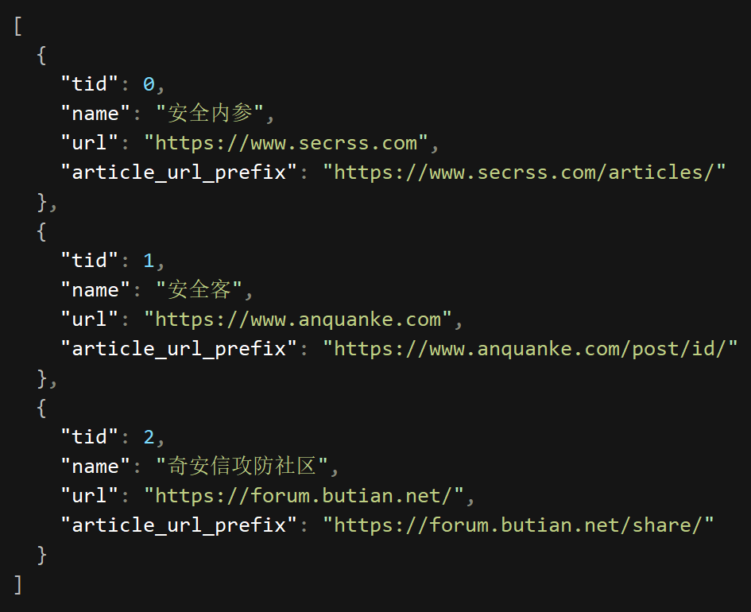
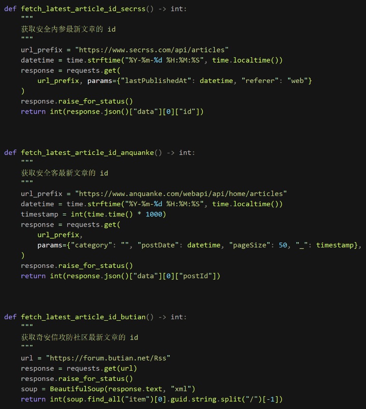
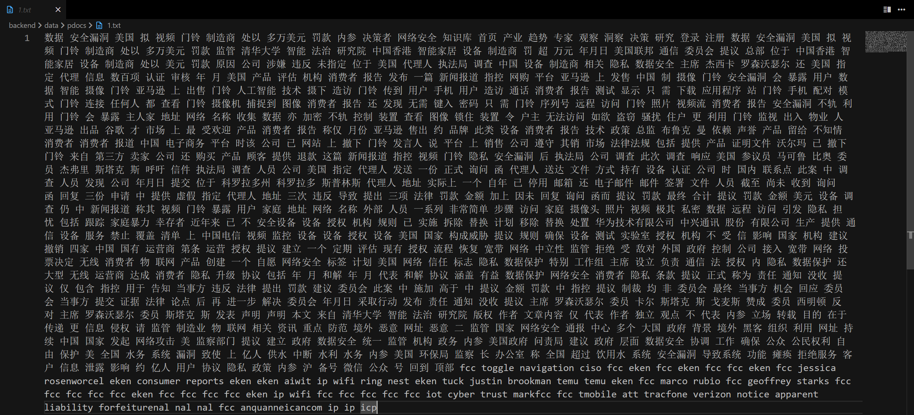
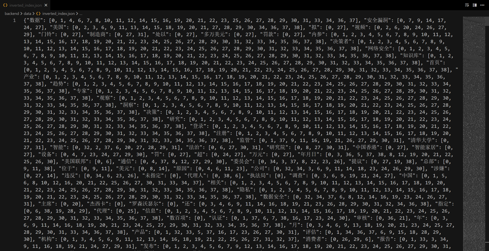

## 作品名称

Seeker Engine - 网络安全资讯搜索引擎

## 需求分析

通过搜索引擎搜索网络安全领域的最新资讯，提供更加精准的，专业的搜索结果。

基于这样的需求，项目需要定向爬取网络安全领域的资讯网站的内容，并对这些内容进行数据处理以构建搜索引擎。

## 开发架构

前后端分离开发，其中前端使用 Vue.js 构建页面，后端使用 FastAPI 构建 Web API 并集成爬虫、数据预处理、搜索引擎模块。

### 爬虫模块

主要使用 requests 和 BeautifulSoup 库爬取预定义目标站点数据，获取原始网页文档集合，数据库存储 odid, url, title 等元数据, 网页原文档则存储到文件系统预定义目录下的 `{odid}.html`。

将目标站点的元数据存储到 json 文件中：

其中每个站点，根据分析，获取他们的文章阅读页 URL 的规则，以及获取最新文章列表的规则，分别构建专门的函数进行爬取：

然后利用这几个函数，构建通用的爬取函数（指定一个 ID，指定范围 ID...）并提供给 FastAPI 用于构建后台任务 API。

### 数据预处理模块

项目实现的搜索引擎主要依赖原理： -倒排索引：即由原始文档集合的关键词构建的倒排索引，基于此可以快速查询某个词语所在的所有文档。 -向量空间模型（Vector Space Model）和余弦相似度：即由原始文档集合构建的 TF-IDF 矩阵，以及搜索词构建的 TF-IDF 向量，通过计算余弦相似度来衡量文档与搜索词的相似性。

TF-IDF 矩阵：由文档集合中的所有文档和所有词语构成的矩阵，其中每个元素表示某个词语在某个文档中的 TF-IDF 值。

- **文档分词**：中文通过 jieba 库进行分词，英文通过 nltk 库进行分词，分词结果元数据存储到数据库，分词结果文档存储到文件系统预定义目录下的 `{pdid}.txt`。

- **倒排索引**：根据分词结果利用 sklearn 库构建文档集合的 TF-IDF 矩阵、`TfidfVectorizer` 对象、倒排索引，并存储到文件系统。

在数据预处理完成后，项目中的 data 目录将会生成如下文件：

- `tfidf_matrix.joblib`: 文档集合的 TF-IDF 矩阵
- `vectorizer.joblib`: `TfidfVectorizer` 对象
- `inverted_index.json`: 倒排索引

### 搜索引擎模块

1. 前段页面输入搜索词，通过 Web API 调用后端搜索引擎模块。
2. 获取搜索词 -> 分词 -> 根据倒排索引查询相关文档。
3. 查询词通过 `TfidfVectorizer` 对象 TF-IDF 向量化 -> 与文档集合的 TF-IDF 矩阵进行余弦相似度计算 -> 返回根据相似度排序的结果。

---

参考文献：

1. Joblib. Running Python functions as pipeline jobs — joblib 1.4.2 documentation[EB/OL]. (2024-11-26)[2024-11-26]. https://joblib.readthedocs.io/en/stable/.
2. fxsjy. jieba/README.md at master · fxsjy/jieba[EB/OL]. (2024-11-26)[2024-11-26]. https://github.com/fxsjy/jieba/blob/master/README.md.
3. NLTK. Natural Language Toolkit[EB/OL]. (2024-11-26)[2024-11-26]. https://www.nltk.org/.
4. 云南旅游攻略搜索引擎设计与实现[EB/OL]. (2024-11-26)[2024-11-26]. https://blog.csdn.net/qq_35993946/article/details/88087827.
5. 知乎用户. 余弦距离与欧式距离[EB/OL]. (2024-11-26)[2024-11-26]. https://zhuanlan.zhihu.com/p/84643138.
