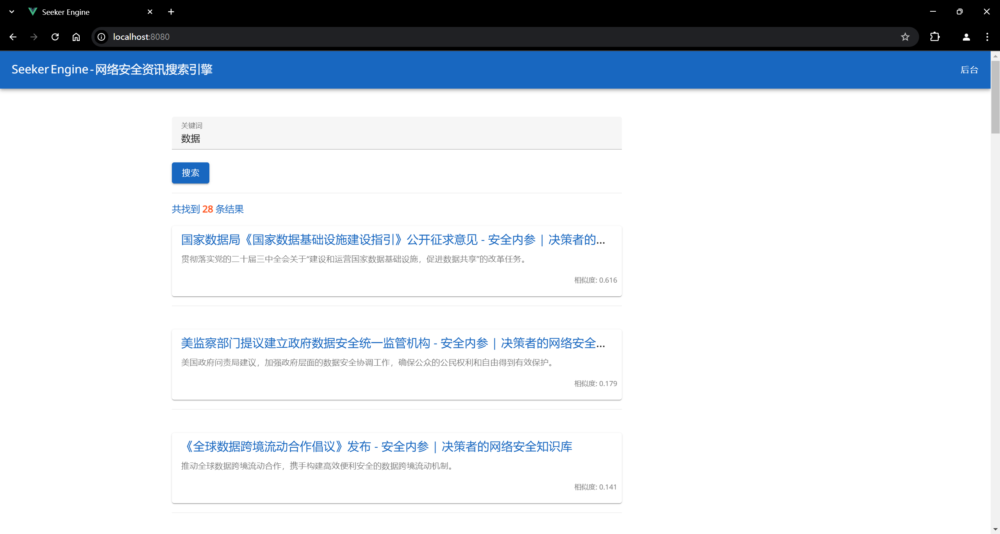
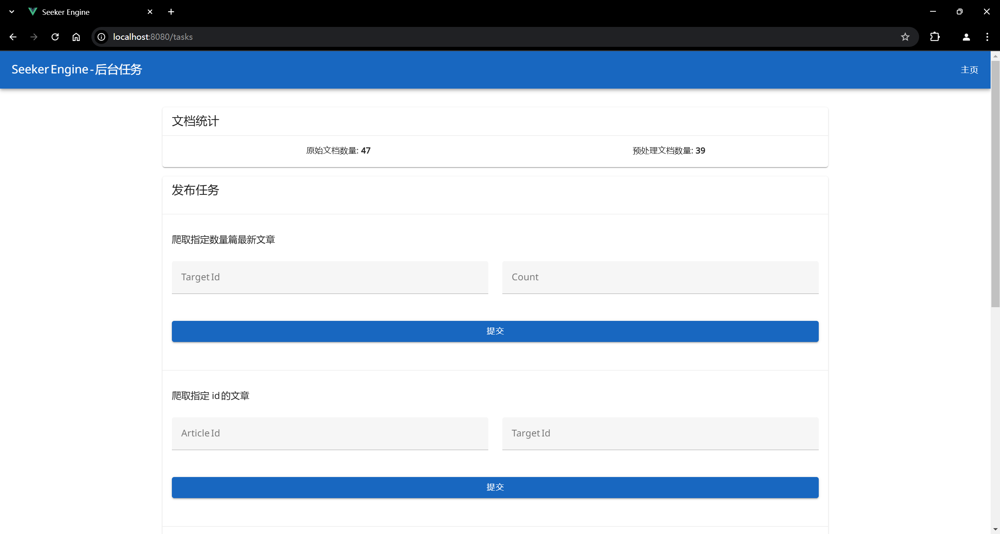

# 期末作品

项目要求：

1. 针对使用 AJAX 或 JavaScript 动态加载内容的网站（如电商平台商品列表），使用 Selenium 或 Puppeteer 模拟浏览器行为抓取数据。
2. 实现分页功能，自动翻页并抓取每一页的商品信息（如名称、价格、销量等）。
3. 将抓取的数据存储到数据库中（如 SQLite 或 MySQL），并设计合理的数据库表结构。
4. 编写简单的 Web 界面（使用 Flask 或 Django），展示数据库中存储的商品信息。

加分项：

1. 引入多线程或异步 IO（如 asyncio）加速数据抓取过程。
2. 使用代理 IP 池避免 IP 被封禁。
3. 对抓取的数据进行简单的去重和清洗。

---

## 作品介绍

  
  

 

**作品名称**：Seeker Engine - 网络安全资讯搜索引擎

**开发架构**：

前端：Vue.js；后端：FastAPI。

其中后端集成了爬虫、数据预处理、搜索引擎模块并提供 API 接口。

**运行步骤**：

1. **爬取数据**：爬取预定义目标站点数据，获取原始网页文档集合，数据库存储 odid, url, title 等元数据, 网页原文档则存储到文件系统预定义目录下的 `{odid}.html`。
2. **数据预处理**：

   - 文档分词：中文 jieba 分词，英文 nltk 分词，分词结果元数据存储到数据库，分词结果文档存储到文件系统预定义目录下的 `{pdid}.txt`。
   - 倒排索引：根据分词结果构建倒排索引，存储到 json 文件。同时构建文档集合的 TF-IDF 矩阵 & `TfidfVectorizer` 对象，存储到 joblib 文件。

3. **查询处理**：获取搜索词 -> 分词 -> 倒排索引查询相关文档 -> TF-IDF 向量化 -> 余弦相似度计算 -> 返回根据相似度排序的结果。
