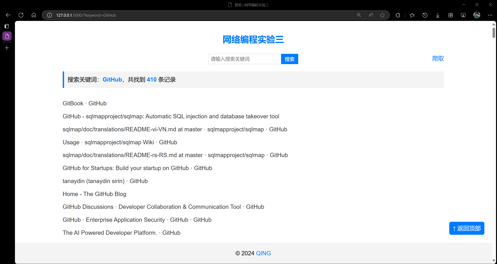

# 实验三

编写 Python 代码，遍历某个特定的包含多个链接的网页中的所有链接，并获取这些链接的标题或基本信息，并学习如何遍历网页中的链接，并获取这些链接的标题或基本信息。

## 运行

```bash
flask run --debug
```

## 效果

- 搜索页面



输入关键词并点击搜索后，页面将展示搜索结果。

- 爬取页面


输入链接并点击爬取后，爬取任务将在后台运行。
