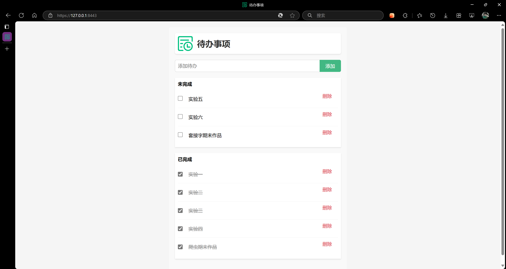

# 期末作品

项目要求：

1. 自定义实现一个简单的 HTTP 服务器，能够处理基本的 HTTP 请求（如 GET、POST）。
2. 服务器能够解析请求 URI，根据请求类型读取静态文件或处理动态内容（如使用 Python 生成 HTML 页面）。
3. 实现 HTTP 客户端，能够发送 HTTP 请求到自定义服务器，并显示响应内容。
4. 引入 HTTPS 支持，使用 SSL/TLS 加密通信数据。
5. 支持 HTTP 持久连接（HTTP/1.1 Keep-Alive）和 HTTP/2 协议的部分特性。

加分项：

1. 实现 HTTP 缓存机制，减少不必要的服务器请求。
2. 支持 HTTP 压缩，如 gzip 压缩，减少网络传输数据量。
3. 设计并实现一个 Web 框架，基于自定义的 HTTP 服务器，提供路由、模板渲染等功能。

---

## 项目介绍

项目名称：Aptche

开发思路：

- 参考 WSGI 规范，实现一个 WSGI 服务器（Aptche HTTP Server）。
- 参考 Flask 语法，实现一个简单的 Web 框架（Aptche Web Framework）。

再基于 Aptche Web 框架，实现一个简单的 TODO List。

---

答辩文档：

项目介绍：

- 项目名称：Aptche
- 项目模块：
  - Aptche HTTP Server: 基于 asyncio 实现的 WSGI 服务器
  - Aptche Web Framework: 基于 Aptche HTTP Server 实现的 Web 框架
  - Aptche TODO List: 基于 Aptche Web Framework 实现的 TODO List

### 开发思路 - Aptche HTTP Server

参考 WSGI 规范，实现一个 WSGI 服务器（Aptche HTTP Server）。

Aptche HTTP Server 基于 asyncio 实现，支持 HTTP/1.1 协议，实现了 HTTP 请求解析、HTTP 响应构造、支持基于 SSL/TLS 的 HTTPS 加密通信。得益于其异步 IO （AIO 模型）特性，Aptche HTTP Server 能够支持高并发的 HTTP 请求处理。

WSGI(Web Server Gateway Interface)，即 Web 服务器网关接口，是 Python 语言中定义的 Web 服务器和 Web 应用程序或框架之间的一种简单而通用的接口，在 [PEP 3333](https://www.python.org/dev/peps/pep-3333/) 中提出。WSGI 的目的是为了提供一种简单的方式，使得 Web 服务器和 Web 应用程序能够通过统一的接口进行通信。

WSGI 在运行时，会调用应用程序提供的一个可调用对象，即 Web 应用程序对象，该对象接收两个参数，分别是一个字典 `environ`（包含请求头信息）和一个可调用对象 `start_response`（用于发送响应数据）。

在本项目中，Aptche HTTP Server 会调用 Aptche Web Framework 提供的 Aptche 类的实例对象（app），将请求信息传递给 app，app 返回响应数据，然后 Aptche HTTP Server 将响应数据发送给客户端。

### 基于 SSL/TLS 的 HTTPS 加密连接

使用 mkcert(https://github.com/FiloSottile/mkcert) 工具生成自签名证书，并在本机安装证书。

然后在 Aptche HTTP Server 中加载密钥和证书证书文件，通过 ssl 模块的 `create_default_context` 方法创建 SSL 上下文，传入 asyncio 的 `start_server` 方法，即可实现 HTTPS 加密连接。

### 开发思路 - Aptche Web Framework

参考 Flask 语法，实现一个简单的 Web 框架（Aptche Web Framework）。

Aptche Web Framework 基于 Aptche HTTP Server 实现，提供路由、模板渲染等功能。Aptche Web Framework 的核心是 Aptche 类，Aptche 类的实例对象（app）是一个 WSGI 应用程序对象，接收请求信息，返回响应数据。

通过 Aptche HTTP Server 提供的 environ 字典，Aptche Web Framework 能够构造一个 request 对象，这个对象是处理后的便于使用的请求信息。

通过构造 route 装饰器，并创建一个 routes 列表来存储 URL 与处理函数的映射关系，Aptche Web Framework 能够根据请求 URL 找到对应的处理函数。

端点函数返回的数据会被传递给 response 对象，response 对象会根据数据类型自动构造响应数据，然后返回给 Aptche HTTP Server。

### 开发思路 - Aptche TODO List

再基于 Aptche Web 框架，实现一个简单的 TODO List。

基本同 Flask 的语法，通过 Aptche Web Framework 提供的路由功能，实现了一个简单的 TODO List，支持添加、删除、完成/未完成等基本功能。
