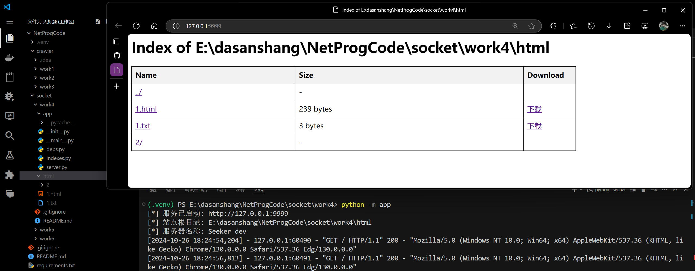

# 实验四

基于 TCP 的文件下载。客户端向服务器发送一个用户输入的文件名，若文件存在，则下载文件，若不存在，则提示用户。 服务端接收客户端数据，识别并显示客户端所请求下载的文件名，若文件存在， 则发送给客户端，若不存在，则提示用户。

---

## 效果



## 运行

- 项目目录下创建好网站根目录文件夹
- `app/__init__.py` 中设置 `WEB_ROOT`。默认这个文件夹命名为 `html`。

```bash
cd work4 && mkdir html # 创建网站根目录文件夹
python -m app
```
